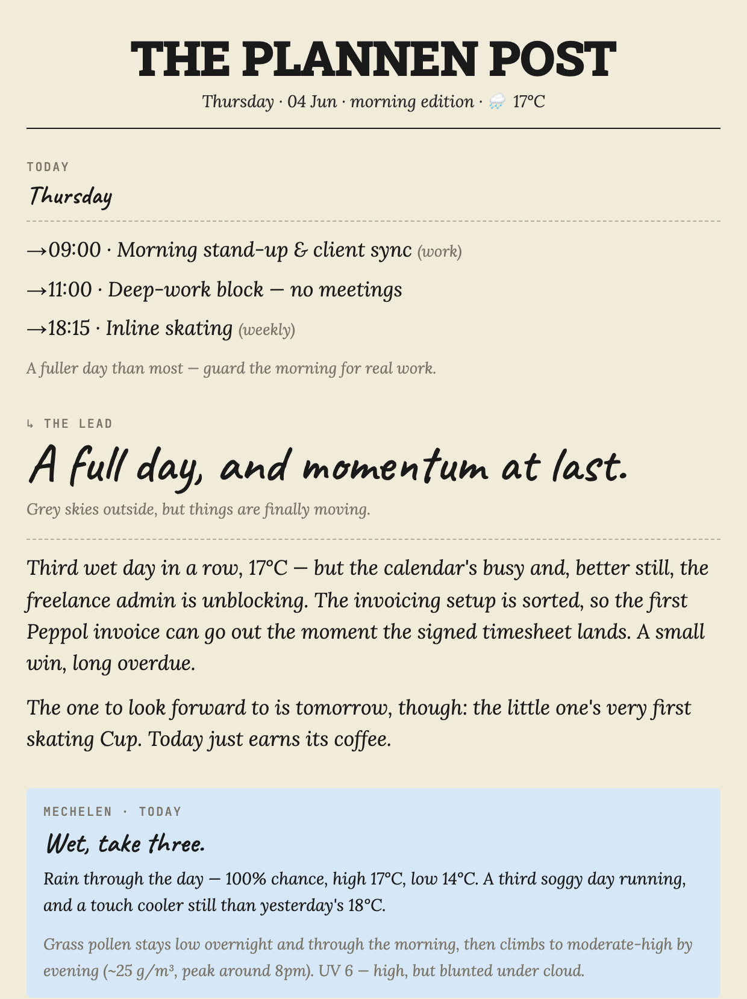
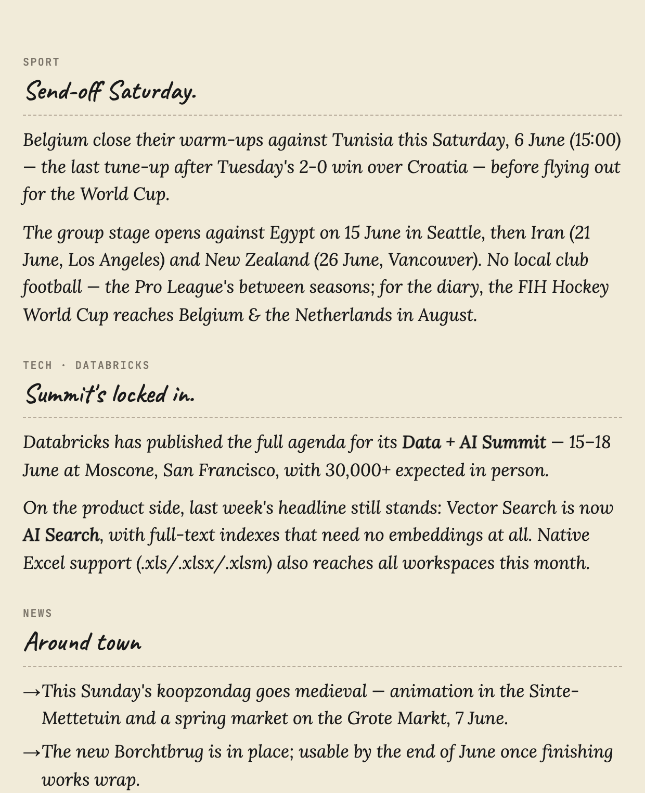
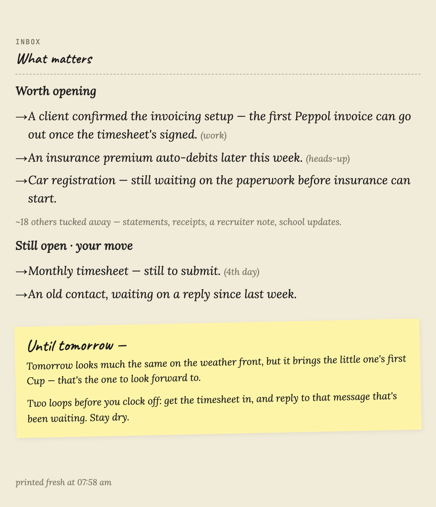

# 📰 plannen-post

A Claude Code plugin that composes a **personalised morning newspaper** from data you already have — calendar, inbox, weather, news, anything an MCP tool, web search, or HTTP can reach — and delivers it to the channel you choose (WhatsApp, a Gmail draft, Telegram, a file).

<p align="center">
  
  &nbsp;
  
  &nbsp;
  
</p>
<p align="center"><em>One edition, three phone-sized pages — your day · the feeds · your inbox.</em></p>

## What you get

- **One page that ties it together** — your calendar, the few emails that actually matter, the weather, and the beats you follow (sport, tech, local news), written as tight prose instead of a dump.
- **Delivered where you read** — a PNG to WhatsApp, a Gmail draft, Telegram, or a file. You choose.
- **Private by design** — no database, no server, no account. State is two small local files plus a rolling 7-day memory.
- **Uses whatever you have** — a section whose source isn't connected is simply skipped; the rest still composes.

## Get started

Install — in any Claude Code session:

```text
/plugin marketplace add pariksheet/plannen-post
/plugin install plannen-post@plannen-post
/reload-plugins
```

Run the commands one at a time. The `/reload-plugins` step (or restarting the session) is what makes the new commands available.

Set it up — detects your connected MCPs and builds your config conversationally, with a live preview:

```text
/post-setup
```

Run today's edition any time:

```text
/post
```

## How it works

1. **Gather** — each *source* (an MCP tool, web search, an HTTP URL, a file) returns data, failure-isolated.
2. **Compose** — the model writes each section from your prose hints: what to lead with, what to skip, the tone.
3. **Render** — fills a styled HTML theme; for chat it slices the edition into phone-sized PNG pages.
4. **Deliver** — dispatches to each *sink* you declared, with fallbacks.

Two small local files drive everything: **`~/.post/config.md`** — the portable content brief (sources, sections, delivery; logical names only, no secrets) — and **`~/.post/profile.yaml`** — the local bindings (keys, routing, must-watch senders; never shared).

---

**Want more?** Run **`/post-help`** in any session for the full guide — sources & sections, scheduling, themes, and troubleshooting — or read [`docs/ARCHITECTURE.md`](docs/ARCHITECTURE.md).
